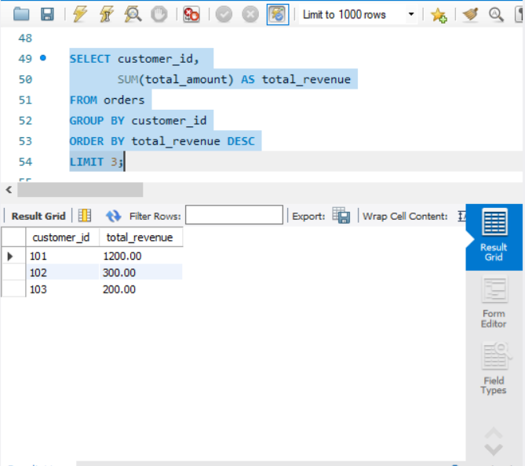
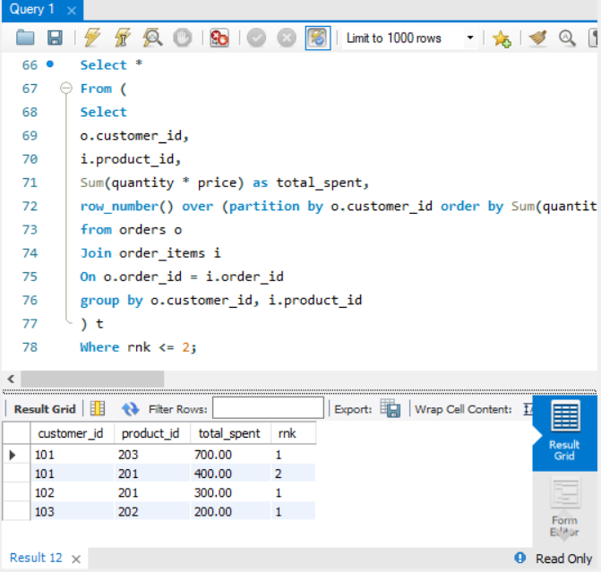

# 📊 E-commerce Sales Analysis

## 📌 Business Problem
Analyze sales data to understand:
- Total revenue
- Customer behavior
- Product performance

---

## 🛠️ Tools Used
- SQL (MySQL Workbench)

---

## 🔍 Key Analysis
- Total Revenue
- Total Orders
- Average Order Value (AOV)
- Revenue by Product
- Top Customers

---

## 📈 Key Insights
- Revenue trends identified across orders
- Top customers contribute significantly to revenue
- Certain products dominate sales

---

## 📂 Project Structure
- data/ → dataset
- sql/ → SQL queries

---

## 🚀 Next Steps
- Add dashboard (Power BI)
- Expand dataset for deeper insights

## 📊 Sample Outputs

### Top Customer Revenue

### Customer Product Spending

